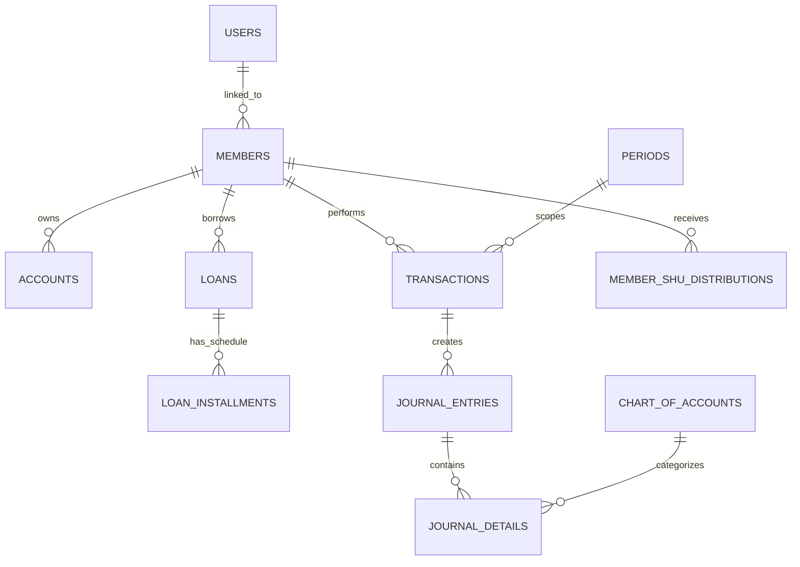

# 🏦 Backend API - Sistem Informasi Koperasi Pelita HKBP Dame

[](https://laravel.com)
[](https://php.net)
[](https://mariadb.org)
[](LICENSE)

Selamat datang di repositori resmi **Backend API Sistem Informasi Koperasi Pelita HKBP Dame**. Sistem ini dirancang untuk mengelola seluruh operasional keuangan, simpan-pinjam, akuntansi 29 kolom tabelaris, pembagian bunga simpanan harian, hingga distribusi SHU (Sisa Hasil Usaha) dan pencetakan dokumen akuntansi koperasi secara otomatis dan presisi.

---

## 📋 Daftar Isi
- [📌 Ringkasan Sistem](#-ringkasan-sistem)
- [✨ Fitur Utama & Modul Domain](#-fitur-utama--modul-domain)
- [📂 Audit & Struktur Folder Backend](#-audit--struktur-folder-backend)
- [📊 Skema Database & Model (ERD Overview)](#-skema-database--model-erd-overview)
- [🛣️ Audit API Endpoints](#️-audit-api-endpoints)
- [🛠️ Artisan Console Commands](#️-artisan-console-commands)
- [💻 Panduan Instalasi & Pengoperasian](#-panduan-instalasi--pengoperasian)
- [🔒 Keamanan & Role Access Control (RBAC)](#-keamanan--role-access-control-rbac)

---

## 📌 Ringkasan Sistem

Sistem Backend Koperasi Pelita HKBP Dame mengadopsi standar akuntansi koperasi Indonesia dengan integrasi dua sistem pembukuan simpanan utama:
1. **Buku Biru (Simpanan Wajib & Simpanan Pokok)**: Berhubungan langsung dengan keanggotaan penuh, kepemilikan saham anggota, dan hak penerimaan Deviden / SHU tahunan & bulanan.
2. **Buku Putih (Simpanan Harian / Sukarela)**: Simpanan harian cair fleksibel yang berhak mendapatkan bunga bulanan (misal 0.6%), memiliki ledger mutasi independen, dan mendukung penutupan buku harian (*Close White Book*) tanpa keluar dari keanggotaan koperasi.

Selain itu, sistem menyediakan **Jurnal Tabelaris 29 Kolom Presisi Manual Koperasi**, pencetakan **Kartu Pinjaman Kuning CUM PELITA**, serta pelaporan otomatis berformat PDF & Excel.

---

## ✨ Fitur Utama & Modul Domain

### 1. 👥 Manajemen Anggota & Keanggotaan (*Members*)
- **Pendaftaran & Pengelolaan Data Anggota**: Pencatatan NIK, Nama, Alamat, No. HP, No. Rekening Buku Biru & Buku Putih.
- **Pengunduran Diri / Resign**:
  - *Close White Book Only*: Penutupan simpanan harian (buku putih) tanpa mengakhiri status anggota.
  - *Resign Total*: Penutupan total seluruh simpanan (buku biru & putih) dan penyesuaian sisa pinjaman.
- **Import & Migrasi Saldo Awal**: Fitur migrasi saldo awal anggota melalui template Excel standar.

### 2. 💸 Manajemen Simpanan & Transaksi Harian (*Transactions*)
- Deposito Simpanan Pokok, Simpanan Wajib, dan Simpanan Harian.
- Penarikan Simpanan Harian & Penanganan Denda keterlambatan.
- Alur persetujuan transaksi (*Transaction Approvals*) oleh Admin & Manajer.
- Transaksi Pendapatan Lain-lain (*Income*) & Pengeluaran Kas (*Expense*).

### 3. 💳 Manajemen Pinjaman & Kartu Kuning (*Loans*)
- **Siklus Pengajuan Pinjaman**: Pengajuan (*Apply*) ➔ Verifikasi Admin ➔ Persetujuan Manajer (*Approve/Reject*) ➔ Pencairan (*Disburse*).
- **Kartu Pinjaman Kuning CUM PELITA**: Generasi otomatis kartu pinjaman lengkap dengan skedul angsuran, perhitungan pokok & bunga, serta export PDF.
- **Pembayaran Cicilan**: Pembayaran angsuran bulanan & riwayat pemotongan saldo.
- **Migrasi Pinjaman Berjalan**: Fasilitas *cut-off balance* untuk memasukkan saldo pinjaman lama yang sedang berjalan.

### 4. 📈 Bunga Simpanan Harian & Pembagian SHU (*Interest & Dividend*)
- **Bunga Buku Putih (0.6%)**: Kalkulasi bunga bulanan simpanan harian & penerbitan **Bukti Memorial** (Format PDF & Excel).
- **Distribusi SHU / Deviden Buku Biru**: Perhitungan deviden berdasarkan proporsi simpanan & partisipasi anggota, Lembar Buku Saham Anggota, dan pengaturan *Benchmark* bulanan.

### 5. 📚 Akuntansi & Laporan Keuangan (*Accounting & Reports*)
- **Chart of Accounts (COA)**: Kode perkiraan akun 5 level yang fleksibel.
- **Jurnal Umum & Buku Besar**: Pencatatan otomatis debit-kredit transaksi harian.
- **Jurnal Tabelaris 29 Kolom**: Laporan rekapitulasi tabelaris 29 kolom sesuai format standar Koperasi Pelita HKBP Dame (Export PDF & Excel).
- **Neraca Lajur & Laba Rugi**: Laporan posisi keuangan (*Trial Balance*) dan kinerja operasional (*Income Statement*).
- **Kunci Periode Akuntansi**: Penguncian mingguan (*Weekly Period Lock*) & penutupan buku tahunan/bulanan (*Period Closing*).

---

## 📂 Audit & Struktur Folder Backend

Berikut adalah audit lengkap struktur direktori repositori `backend-koperasi`:

```
backend-koperasi/
├── app/
│   ├── Console/
│   │   └── Commands/
│   │       ├── CalculateMonthlyInterest.php     # Command hitung bunga simpanan harian (0.6%)
│   │       ├── CheckInactiveMembers.php         # Check status keaktifan anggota
│   │       ├── CleanTestData.php                # Pembersihan data uji coba (Reset Test Data)
│   │       ├── FixPeriodStatus.php              # Perbaikan integritas status periode akuntansi
│   │       └── RecalculateMemberBalances.php   # Recalculate & sinking ulang saldo anggota
│   ├── Http/
│   │   ├── Controllers/
│   │   │   └── Api/
│   │   │       ├── AccountingController.php               # Endpoint Neraca Lajur & Kunci Mingguan
│   │   │       ├── AdminProfileController.php             # Pengaturan & Profil Admin
│   │   │       ├── AnnouncementController.php           # CRUD Pengumuman Koperasi
│   │   │       ├── AuthController.php                   # Login/Logout Sanctum Authentication
│   │   │       ├── BukuPutihLedgerController.php          # Mutasi & Cetak Buku Putih
│   │   │       ├── CashRecapController.php                # Rekapitulasi Kas Masuk/Keluar
│   │   │       ├── ChartOfAccountController.php           # Kelola Kode Perkiraan (COA)
│   │   │       ├── DashboardController.php                # Summary & Chart Arus Kas Admin
│   │   │       ├── DividendController.php                 # Distribusi SHU / Deviden Buku Biru
│   │   │       ├── IncomeController.php                   # Pendapatan Lain-lain / Kas Masuk
│   │   │       ├── InterestController.php                 # Distribusi Bunga Buku Putih (0.6%)
│   │   │       ├── KoperasiController.php                 # Pengaturan Profil Koperasi
│   │   │       ├── LoanController.php                     # Pengajuan, Approval & Kartu Pinjaman
│   │   │       ├── ManagerCashTransactionController.php   # Transaksi Kas Khusus Manajer
│   │   │       ├── ManagerDashboardController.php         # Ringkasan Eksekutif & Stats Manajer
│   │   │       ├── ManagerSettingController.php           # Setting Persentase SHU Manajer
│   │   │       ├── MemberController.php                   # CRUD Anggota & Import Saldo Awal
│   │   │       ├── MemberMigrationController.php          # Template Migrasi & Export Saldo
│   │   │       ├── MemberResignationController.php       # Penutupan Buku Putih & Resign Total
│   │   │       ├── MonthlyCooperativeBenchmarkController.php # Master Benchmark SHU Bulanan
│   │   │       ├── NotificationController.php             # Notifikasi Real-time User/Admin
│   │   │       ├── PeriodController.php                   # Manajemen Periode & Tutup Buku
│   │   │       ├── ReportController.php                   # Laporan Akuntansi (Ledger, Neraca)
│   │   │       ├── ShuController.php                      # Rekapitulasi SHU Bulanan
│   │   │       ├── TabelarisController.php                # Jurnal Tabelaris 29 Kolom (PDF/Excel)
│   │   │       └── TransactionApprovalController.php      # Approval Transaksi Harian
│   │   ├── Middleware/
│   │   │   ├── CheckPeriodLockMiddleware.php    # Proteksi transaksi pada periode terkunci
│   │   │   └── RoleMiddleware.php               # Middleware Hak Akses Role (admin/manager/member)
│   │   └── Requests/
│   │       └── Api/                             # Validation Form Request Classes
│   ├── Jobs/
│   │   └── ImportMembersJob.php                 # Queue Job Import Data Anggota Massal
│   └── Models/
│       ├── Account.php                          # Rekening Simpanan Anggota
│       ├── AccountingPeriod.php                 # Periode Pembukuan Akuntansi
│       ├── ActivityLog.php                      # Audit Trail Log Aktivitas Pengguna
│       ├── Announcement.php                     # Berita / Pengumuman Koperasi
│       ├── ChartOfAccount.php                   # Master Akun / COA
│       ├── Coa.php                              # Alias / Sub-model COA
│       ├── DividendDistribution.php             # Histori Distribusi Deviden
│       ├── JournalDetail.php                    # Detail Rincian Jurnal (Debit/Kredit)
│       ├── JournalEntry.php                     # Header Transaksi Jurnal Umum
│       ├── Loan.php                             # Data Pinjaman Anggota
│       ├── LoanInstallment.php                  # Jadwal & Realisasi Angsuran Pinjaman
│       ├── Member.php                           # Data Pokok Anggota Koperasi
│       ├── MemberShuDistribution.php            # Pembagian SHU per Anggota
│       ├── MonthlyCooperativeBenchmark.php      # Parameter Acuan SHU Bulanan
│       ├── MonthlyShu.php                       # Pencatatan SHU Bulanan
│       ├── Notification.php                     # Log Notifikasi Sistem
│       ├── Period.php                           # Periode Operasional Koperasi
│       ├── ShuDistribution.php                  # Master Distribusi SHU
│       ├── Transaction.php                      # Mutasi Transaksi Simpanan & Kas
│       ├── User.php                             # Akun Login User System
│       └── WeeklyPeriodLock.php                 # Penguncian Transaksi Mingguan
├── bootstrap/                                   # Inisialisasi Framework Laravel 12
├── config/                                      # File Konfigurasi (app, database, sanctum, dompdf, dll)
├── database/
│   ├── factories/                               # Factory Data Palsu untuk Testing
│   ├── migrations/                              # 39+ File Migrasi Skema Database
│   └── seeders/                                 # Seeder Data Awal (Default COA, Admin, User)
├── public/                                      # Public Assets & Index Entry Point
├── resources/
│   └── views/                                   # Template Blade PDF (Kartu Pinjaman, Tabelaris, Memorial)
├── routes/
│   ├── api.php                                  # Seluruh Endpoint REST API (380+ Baris Route)
│   ├── console.php                              # Artisan Schedule & Custom Commands Route
│   └── web.php                                  # Web Fallback Route
├── storage/                                     # Log File, Cache, & Uploaded Attachments
└── tests/                                       # Unit Test & Feature Test Suites
```

---

## 📊 Skema Database & Model (ERD Overview)

Sistem menggunakan database relasional MariaDB/MySQL (`db_koperasi`). Berikut adalah entitas utama dan keterhubungannya:



### Tabel Utama:
- **`users`**: Menyimpan kredensial login, NIK/Email, password hash, role (`admin`, `manager`, `member`).
- **`members`**: Data profil anggota (No. Anggota, Nama, Alamat, No. Rekening Buku Biru, No. Rekening Buku Putih, Status Aktif).
- **`accounts`**: Rekening saldo anggota (Simpanan Pokok, Simpanan Wajib, Simpanan Harian).
- **`transactions`**: Log transaksi simpanan/penarikan, nomor kuitansi, tipe transaksi, status approval.
- **`loans`**: Data pengajuan & persetujuan pinjaman, jumlah plafond, jasa/bunga, tenor, status pinjaman.
- **`loan_installments`**: Skedul dan histori angsuran pinjaman (pokok, bunga, denda).
- **`chart_of_accounts`**: Kode Akun Perkiraan (Aktiva, Pasiva, Ekuitas, Pendapatan, Beban).
- **`journal_entries` & `journal_details`**: Jurnal ganda debit-kredit untuk pembukuan otomatis.
- **`periods` & `weekly_period_locks`**: Manajemen tutup buku dan penguncian periode.

---

## 🛣️ Audit API Endpoints

Seluruh API menggunakan awalan `/api` dan diproteksi oleh middleware `auth:sanctum` (kecuali `/api/login`).

### 🔐 Autentikasi
| Method | Endpoint | Deskripsi | Hak Akses |
|---|---|---|---|
| `POST` | `/api/login` | Login dengan NIK/Email & Password | Publik |
| `POST` | `/api/logout` | Revoke token Sanctum | Auth |
| `GET` | `/api/me` | Ambil profil pengguna terautentikasi | Auth |

### 👥 Manajemen Anggota (`/api/members`)
| Method | Endpoint | Deskripsi | Hak Akses |
|---|---|---|---|
| `GET` | `/api/members` | Listing seluruh data anggota | Admin / Manager |
| `POST` | `/api/members` | Tambah anggota baru | Admin |
| `GET` | `/api/members/{id}/details` | Detail profil & rincian simpanan anggota | Auth |
| `POST` | `/api/members/{id}/close-white-book` | Penutupan akun Buku Putih saja | Admin / Manager |
| `POST` | `/api/members/{id}/resign-total` | Pengunduran diri total anggota | Admin / Manager |
| `GET` | `/api/members/migration/template` | Download template Excel migrasi saldo | Admin / Manager |
| `POST` | `/api/members/import-initial` | Import saldo awal anggota dari Excel | Admin |

### 💳 Pinjaman & Kartu Kuning (`/api/loans`)
| Method | Endpoint | Deskripsi | Hak Akses |
|---|---|---|---|
| `POST` | `/api/loans/apply` | Pengajuan pinjaman baru | Member / Admin |
| `POST` | `/api/loans/{id}/verify` | Verifikasi awal pinjaman oleh Admin | Admin |
| `POST` | `/api/loans/{id}/approve-manager` | Persetujuan final pinjaman oleh Manajer | Manager |
| `POST` | `/api/loans/{id}/disburse` | Pencairan dana pinjaman | Admin |
| `POST` | `/api/loans/installments/{id}/pay` | Pembayaran angsuran pinjaman | Admin |
| `GET` | `/api/loans/{id}/card/pdf` | Export PDF Kartu Pinjaman Kuning CUM PELITA | Auth / Token |

### 📈 Bunga & SHU / Deviden
| Method | Endpoint | Deskripsi | Hak Akses |
|---|---|---|---|
| `GET` | `/api/manager/interest/preview` | Preview perhitungan bunga Buku Putih (0.6%) | Manager |
| `POST` | `/api/manager/interest/distribute` | Proses pembagian bunga & terbitkan Memorial | Manager |
| `GET` | `/api/manager/dividends/preview` | Preview kalkulasi SHU / Deviden Buku Biru | Manager |
| `POST` | `/api/manager/dividends/distribute` | Proses eksekusi pembagian SHU | Manager |
| `GET` | `/api/manager/coop-benchmarks` | Master tabel acuan parameter SHU bulanan | Manager |

### 📚 Akuntansi & Laporan (`/api/reports` & `/api/tabelaris`)
| Method | Endpoint | Deskripsi | Hak Akses |
|---|---|---|---|
| `GET` | `/api/chart-of-accounts` | Daftar Kode Perkiraan (COA) | Auth |
| `GET` | `/api/tabelaris` | Data Jurnal Tabelaris 29 Kolom | Auth |
| `GET` | `/api/tabelaris/export-excel` | Export Jurnal Tabelaris 29 Kolom ke Excel | Auth / Token |
| `GET` | `/api/tabelaris/export-pdf` | Export Jurnal Tabelaris 29 Kolom ke PDF | Auth / Token |
| `GET` | `/api/reports/cash-recap` | Rekapitulasi Kas Masuk & Kas Keluar | Auth |
| `GET` | `/api/reports/trial-balance` | Laporan Neraca Lajur | Auth |
| `GET` | `/api/reports/income-statement` | Laporan Laba Rugi Koperasi | Auth |

---

## 🛠️ Artisan Console Commands

Backend ini dilengkapi perintah khusus Artisan untuk otomasi dan pemeliharaan sistem:

```bash
# 1. Menghitung & mendistribusikan bunga bulanan simpanan harian secara otomatis
php artisan interest:calculate-monthly

# 2. Melakukan sinkronisasi dan kalkulasi ulang seluruh saldo anggota
php artisan members:recalculate-balances

# 3. Mengatur ulang status keaktifan anggota berdasarkan kriteria transaksi
php artisan members:check-inactive

# 4. Memperbaiki status penguncian periode akuntansi yang tidak konsisten
php artisan period:fix-status

# 5. Membersihkan data uji coba (Reset Test Data - Khusus lingkungan Development)
php artisan test:clean-data
```

---

## 💻 Panduan Instalasi & Pengoperasian

### Prerequisites (Persyaratan Sistem)
- **PHP** >= 8.2 (dengan ekstensi `pdo_mysql`, `mbstring`, `gd`, `zip`, `xml`)
- **Composer** >= 2.x
- **MySQL / MariaDB** (via XAMPP / Standalone)
- **Node.js** >= 18.x & NPM

### Langkah-langkah Setup:

1. **Clone Repositori & Masuk Ke Direktori Project**:
   ```bash
   cd c:\Users\WIN-11\backend-koperasi
   ```

2. **Instalasi Dependensi PHP & Node.js**:
   ```bash
   composer install
   npm install
   ```

3. **Konfigurasi Environment (`.env`)**:
   Duplikasi file `.env.example` menjadi `.env` dan sesuaikan konfigurasi database:
   ```env
   APP_NAME="Koperasi Pelita HKBP Dame"
   APP_ENV=local
   APP_KEY=
   APP_URL=http://localhost:8000

   DB_CONNECTION=mysql
   DB_HOST=127.0.0.1
   DB_PORT=3306
   DB_DATABASE=db_koperasi
   DB_USERNAME=root
   DB_PASSWORD=
   ```

4. **Generate Application Key & Jalankan Migrasi**:
   ```bash
   php artisan key:generate
   php artisan migrate --seed
   ```

5. **Menjalankan Server Development**:
   Gunakan script bawaan composer untuk menjalankan server Laravel, Queue Listener, dan Vite secara bersamaan:
   ```bash
   composer dev
   ```
   Atau jalankan server Laravel mandiri:
   ```bash
   php artisan serve
   ```

---

## 🔒 Keamanan & Role Access Control (RBAC)

Sistem menerapkan pengamanan berlapis:
- **Sanctum Bearer Token**: Setiap request API terproteksi wajib menyertakan header `Authorization: Bearer <TOKEN>`.
- **Role-Based Access Control (`RoleMiddleware`)**:
  - `admin`: Mengelola data anggota, transaksi harian, pengajuan pinjaman, dan pencairan.
  - `manager`: Hak akses penuh pengesahan pinjaman, pembagian bunga (0.6%), eksekusi SHU bulanan, penguncian periode, dan laporan eksekutif.
  - `member`: Akses mandiri untuk melihat profil, saldo simpanan, pengajuan pinjaman mandiri, dan riwayat kartu pinjaman.
- **Period Locking (`CheckPeriodLockMiddleware`)**: Mencegah manipulasi atau pengubahan transaksi pada periode tanggal yang telah dikunci atau ditutup bukunya.

---

<p align="center">
  <b>© 2026 Koperasi Pelita HKBP Dame. All Rights Reserved.</b><br>
  <i>Dikembangkan untuk efisiensi, akurasi, dan transparansi pengelolaan keuangan Koperasi Pelita HKBP Dame.</i>
</p>
